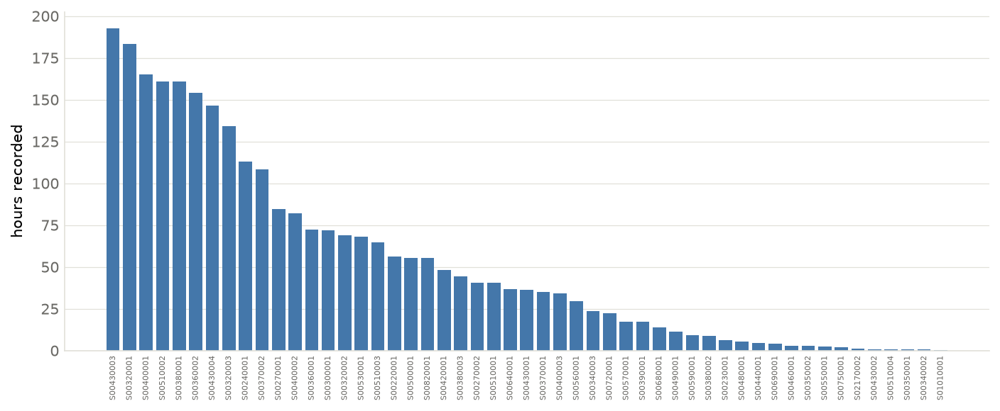

# The data {#sec-data}



Everything in this book is learned from **BabyView 2025.2**, a corpus of head-mounted
camera recordings from young children's daily lives, paired with transcribed speech. This
chapter describes what the corpus contains, why *referential alignment* is the central
problem it poses, and the two annotations — CLIP and Gemini — we use to estimate which
moments of speech are actually about something visible.

## Scale

At 1 frame per second, aligned to transcribed utterances, the corpus gives:

| | |
|---|---|
| children | **36** |
| recordings (videos) | **8,188** |
| utterance–frame pairs | **1,145,312** |
| total footage | **~1,390 h** (lower bound) |
| training vocabulary (≥5 occurrences) | 14,888 words |

This is roughly two orders of magnitude more data than SAYCam-S (the single-child corpus
behind CVCL), and it spans many homes rather than one — a difference that matters for both
*amount* and *diversity* (@sec-scaling).

## What the speech looks like

Child-directed speech in the wild is **short and mostly not referential**. Utterances have a
median of **3 tokens** (mean 4.2; @fig-data), and — as the annotations below quantify — the
overwhelming majority of them are not naming anything visible on screen at that moment. This
is the core obstacle: a naive contrastive learner that pairs every utterance with its frame is
training on a signal that is ~90% noise.

The data is also **extremely uneven across children**: the median child contributes ~19,600
utterance–frame pairs, but the interquartile range runs from ~2,700 to ~43,500, and the
extremes span 253 to 134,686. Who contributes how much is itself a variable we return to in
@sec-scaling.

{#fig-data width=100%}

## Two annotations of alignment

Because most speech is non-referential, we need a way to estimate, for each (utterance, frame)
pair, *how strongly the utterance refers to a concrete object visible in the frame*. We use two,
and the difference between them matters throughout the book.

**CLIP** (`clip_score_max`) scores the whole frame against the utterance with a pretrained
CLIP model. It is cheap and requires no extra infrastructure, but its distribution is
**extremely compressed** — mean 0.224, sd **0.015** — so the entire aligned/misaligned
distinction lives in a razor-thin band, which is why a fixed threshold (e.g. 0.24) is so
delicate. And because it scores the *whole frame*, it is easily fooled — it
scores on-screen *text* and topical keywords highly even when nothing is depicted.

**Gemini** (`alignment`, 0–100, plus a `referent` noun) is a per-pair judgment from Gemini 2.5
Flash on Vertex AI: *does this utterance name a concrete object visible in this frame, and which
one?* It is an IRB-approved annotation pass over the full corpus (frames are human-subjects data
and never leave the approved pipeline). Its distribution is **bimodal and decisive**: **91%** of
pairs score 0 (correctly — most speech is not referential), while **9.2%** clear ≥50 and 6.0%
clear ≥80, each carrying a candidate referent word. This matches the intuition that only a small
minority of moments are genuine naming events.

**The two annotations substantially disagree** — Spearman ρ ≈ 0.14 over the full corpus (ρ ≈
0.22 on the referential tail), i.e. a lot of *independent* signal (@fig-data, right). Inspection
of the disagreements favors Gemini: it recovers referents CLIP misses — shared **book reading**
("Llama Llama" → `book`), toys, and objects on TV screens — and it rejects CLIP's keyword
false-positives (abstract talk about a "high chair," deictic "get it"). A direct test confirms
it: at matched count, training on a Gemini-selected set is at least as good as a CLIP-selected
one on the clean eval, and its referent labels open a much larger headroom (@sec-bootstrapping).

Throughout the rest of the book, **Gemini is the gold definition of alignment** (and its
referent the gold label), with CLIP kept as the cheaper, weaker comparison and as the annotation
behind the preliminary experiments of the appendices.

## The 2026.1 consolidated release {#sec-data-2026}

The chapters above describe the **2025.2** working release the experiments were developed on.
For the paper-phase experiments, everything moves to **2026.1**: 16,306 videos from **51
children** (2,701 hours; ages 2.9–54 months at recording, median 17.0), a strict superset of
2025.2 (8,566 shared videos, byte-identical; 11,735 new). All layers were consolidated under
one root with a single key convention, and every claim below is generated from the committed
diagnostics bundle (`diagnostics/2026.1/`, extracted on-cluster by `src/make_diagnostics.py`).

**Annotation layers.** Each layer covers the release nearly completely, and every layer joins
on the same keys (video, and utterance or frame within video):

{#fig-diag-coverage}

- **Transcripts**: 1,838,288 ASR utterances (16,008 videos have speech).
- **Referent annotation** (Gemini alignment 0–100 + referent word): 1,838,061 of 1,838,134
  utterance–frame training pairs scored (99.996%).
- **Language annotation** (two independent Gemini passes + agreement): all 1,838,288
  utterances; 99.4% pass agreement, 99.05% English among agreed utterances.
- **Pose**: 8.3M person detections; 65% of frames contain at least one person.
- **Embeddings**: DINOv3-B 4×4 region grid for all 1,745,489 training-pair frames.

**Recording effort and age.** Contribution is uneven — the largest contributor provides 7.1%
of all hours — which motivates the child-diversity analyses of @sec-scaling:

{#fig-diag-age}

{#fig-diag-hours}

**Speech density** is stable across videos and children (median ≈ 700 utterances/hour), with
no outlier children that would indicate transcription failures:

{#fig-diag-density}

**Reported vs measured language.** The household survey's "% English" disagrees sharply with
what is actually on the recordings (r = 0.46): children whose families report 0–1% English
measure 88–94% English in their labelled utterances. This is why the English-language filter
used for the main experiments is based on *measured* utterance labels, not the survey:

{#fig-diag-english}

{#fig-diag-dists}
